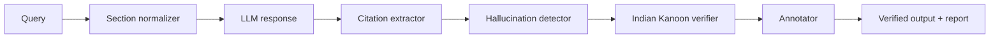

# BRAHMO Citation Safety Engine

Deterministic citation verification for Indian legal AI. The app extracts case citations from LLM output, pre-filters impossible cites, verifies against [Indian Kanoon](https://indiankanoon.org), normalizes repealed IPC/CrPC/IEA sections to BNS/BNSS/BSA, and returns annotated safe output with a downloadable verification report.

**Core principle:** verification is deterministic. Citation validation never uses AI reasoning.

## Architecture flow

```
Lawyer query
    → Section normalizer (deterministic, Supabase mappings)
    → LLM API (generative — Gemini or offline mock)
    → Raw legal memo + citations
    → Citation safety engine (deterministic)
         extract → hallucination pre-filter → Indian Kanoon verify → annotate
    → Lawyer-facing verified output + report + session history
```

The safety engine **never** calls the LLM. The LLM **never** calls the safety engine.



| Stage | Module | Role |
|-------|--------|------|
| 1 | `section-normalizer.ts` | IPC/CrPC/IEA → BNS/BNSS/BSA in query and response |
| 2 | `citation-extractor.ts` | Regex scan using DB `citation_patterns` |
| 3 | `hallucination-detector.ts` | Future year, impossible SCC volume, suspicious page |
| 4 | `citation-verifier.ts` | Cache + Indian Kanoon batch verify |
| 5 | `citation-annotator.ts` | Badges, strikethrough, summary counts |
| 6 | `citation-safety-pipeline.ts` | Orchestration + metrics |

See [docs/architecture.md](docs/architecture.md) and [data_sources.md](data_sources.md) for detail.

## Prerequisites

- Node.js 20+
- Supabase project (free tier)
- Optional: `LLM_API_KEY`, `INDIAN_KANOON_API_KEY` (offline mock works without keys)

## Setup

```bash
npm install
cp .env.example .env
# or: cp .env.example .env.local
```

Edit `.env` (or `.env.local`) — **never commit** this file. Only `.env.example` belongs in Git.

### Supabase

1. Create a project at [supabase.com](https://supabase.com).
2. SQL Editor → run `supabase/schema.sql`, then `supabase/seed.sql`.
3. Confirm: `SELECT COUNT(*) FROM section_mappings;` → **30**
4. Confirm: `SELECT COUNT(*) FROM citation_patterns;` → **6**

## Environment variables

Copy from `.env.example`:

| Variable | Required | Description |
|----------|----------|-------------|
| `NEXT_PUBLIC_SUPABASE_URL` | Yes | Supabase project URL (browser-safe) |
| `NEXT_PUBLIC_SUPABASE_ANON_KEY` | Yes | Supabase anon/publishable key |
| `LLM_PROVIDER` | No | `openai` (default) or `gemini` |
| `LLM_MODEL` | No | e.g. `gpt-4o-mini`, `gemini-2.5-flash-lite` |
| `LLM_API_KEY` | No | Server-only; omit for mock LLM |
| `INDIAN_KANOON_API_KEY` | No* | Server-only IK token; omit uses verifier mocks in dev |
| `NORMALIZATION_MODE` | No | `normalize_to_current_codes` (default) or `preserve_original` |
| `LLM_FALLBACK_MODELS` | No | Comma-separated Gemini fallbacks if primary fails |

\* IK key recommended for live verification demos.

## How to run

```bash
npm run dev
```

Open [http://localhost:3000](http://localhost:3000).

Production:

```bash
npm run build
npm start
```

## Test commands

```bash
npm test          # unit tests (extractor, verifier, hallucination, sections, report)
npm run build     # production build + TypeScript check
npm run lint      # ESLint
```

## Demo scenarios (interview script)

Use the matter dropdown and **Ask with Citation Verification**. Say clearly:

> Verification is deterministic. We intentionally avoided using AI reasoning for citation validation.

### Demo 1 — Valid citations

1. Select matter **Anticipatory bail — economic offences** (`demo-bail`) or **Electronic evidence — Section 65B** (`demo-65b`).
2. Query (pre-filled): anticipatory bail precedents or Section 65B admissibility.
3. Click **Ask with Citation Verification**.
4. **Show:** green VERIFIED badges on real SCC/AIR cites; section panel maps IPC/CrPC/IEA → BNS/BNSS/BSA where applicable; report shows accuracy % and low IK cost from cache.

### Demo 2 — Fake / hallucinated citations

1. Select **Hallucinated Supreme Court cite** (`demo-hallucinated`).
2. Query: `Mercy v. Mankind (2024) 12 SCC 999` (fictitious).
3. **Show:** hallucination pre-filter flags impossible reporter metadata; cite marked REMOVED or UNVERIFIED; strikethrough in annotated column; report lists hallucinated count.

### Demo 3 — Malformed citations + normalization

1. Select **Malformed citation format** (`demo-malformed`).
2. Query includes `(2023)5 SCC123` and `2024 SCC OnLine Del 3456` (spacing typos).
3. **Show:** extractor normalizes spacing; verifier CORRECTED or VERIFIED after normalization; Section 482 BNSS reference with IPC→BNSS mapping alerts in the side panel.

**Bonus — Mixed:** matter `demo-mixed` — AIR 2004 SC 3358 verified beside `(2028) 3 SCC 45` removed as future-year hallucination.

## Self-test checklist (before submission)

| Test | How |
|------|-----|
| Valid citations | `demo-bail` or `demo-65b` → verified badges |
| Fake citations | `demo-hallucinated` → REMOVED / hallucination flags |
| Malformed citations | `demo-malformed` → spacing correction |
| Mixed citations | `demo-mixed` → mix of verified + removed |
| Section normalization | Any matter with IPC/CrPC in query → BNS/BNSS alerts |
| No-citation query | Type a general question with no case cite → empty citation list |
| Session history | Run verification → entry appears in sidebar → reload session |
| Download report | **Download report** button → JSON/text export |
| Responsive UI | Resize browser to mobile width — layout stacks |

## Features

- Side-by-side generic LLM vs citation-verified response
- Six reporter patterns (DB-driven): SCC, SCC OnLine, AIR, Cri LJ, SCR, MANU
- 30 section mappings (assessment seed)
- Hallucination pre-filter and Indian Kanoon verification with Supabase cache
- Eight legal matters + four one-click demo scenarios
- Session persistence and verification report download

## Project structure

```
src/lib/           # Pipeline: extractor, verifier, normalizer, annotator
src/app/api/       # LLM proxy, citation-check, sessions, normalize-sections
src/components/    # Dashboard UI
supabase/          # schema.sql, seed.sql, migrations/
docs/architecture.md
data_sources.md
```

## Screenshots

Add PNG captures under `docs/screenshots/` (optional for assessors):

- Dashboard side-by-side view
- Verified vs removed citation badges
- Section normalization alerts
- Verification report panel

## API routes

| Route | Purpose |
|-------|---------|
| `POST /api/llm` | LLM or mock (matter-aware) |
| `POST /api/citation-check` | Full pipeline + report + session |
| `POST /api/normalize-sections` | Section normalizer smoke test |
| `POST /api/sessions` | List / create sessions |


## License

Private — BRAHMO technical assessment submission.
